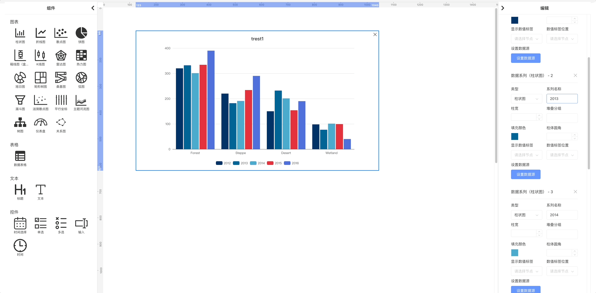

# ngx-puzzle

English | [中文文档](README.zh-CN.md)

[](https://www.npmjs.com/package/@zhongmiao/ngx-puzzle)
[](https://www.npmjs.com/package/@zhongmiao/ngx-puzzle)

[](LICENSE)
[](https://github.com/prettier/prettier)

👉 Example repository (Demo): https://github.com/zhongmiao-org/ngx-puzzle-example



Drag-and-drop dashboard builder for Angular applications. Think of it like a puzzle: compose charts, tables, text, and controls on a canvas to quickly assemble responsive data dashboards. Built with Angular standalone components and signals.

Suitable for rapid prototyping, internal BI dashboards, and data visualization portals.

## Features

- Drag-and-drop editor with snapping layout
- Rich built-in components: chart, table, text, control
- Architecture-first Angular library (standalone, signals, OnPush)
- External data-binding contract to connect real APIs or mock data
- Preview/save via external service hooks

## Installation

Prefer ng add. Manual install is also supported.

### Option 1: ng add (recommended)

```bash
ng new test-app --routing=true --style=scss
# or
# npx @angular/cli@18 new my-angular18-app
cd my-angular18-app
ng add @zhongmiao/ngx-puzzle
```

```bash
✔ Determining Package Manager
  › Using package manager: npm
✔ Loading package information from registry
✔ Confirming installation
✔ Installing package
    Added @angular/cdk@^18.2.14 to dependencies
    Added @webdatarocks/webdatarocks@1.4.19 to dependencies
    Added echarts@^6.0.0 to dependencies
    Added lodash@4.17.21 to dependencies
    Added ngx-tethys@^18.2.17 to dependencies
    Added asset mapping: ./node_modules/@zhongmiao/ngx-puzzle/assets -> /assets
    Prepended style import to src/styles.scss: @import "@zhongmiao/ngx-puzzle/styles/index.scss";
    Prepended style import to src/styles.scss: @import 'ngx-tethys/styles/index.scss';
    Added import for provideHttpClient in src/app/app.config.ts
    Added import for providePuzzleLib in src/app/app.config.ts
    Updated assets configuration to include library assets.
    ✅ Configuration updated successfully!
    📦 New dependencies have been added to package.json
    🚀 Please run the following command to install dependencies:
       npm install
UPDATE package.json (1246 bytes)
UPDATE src/styles.scss (171 bytes)
UPDATE src/app/app.config.ts (493 bytes)
UPDATE angular.json (3049 bytes)
```

- If your CLI is older or auto-append fails, use the manual assets configuration below.

### Option 2: Install via package manager

```bash
npm install @zhongmiao/ngx-puzzle
# peer deps
# Angular 18+, RxJS 7.8+, ngx-tethys 18.x, echarts 6.x
```

#### Global styles and static assets

Add global style imports in your app's src/styles.scss:

```scss
@import "@zhongmiao/ngx-puzzle/styles/index.scss";
@import "ngx-tethys/styles/index.scss";
```

As a standalone-first library, ngx-puzzle provides a ready-made provider. Add provideHttpClient() and providePuzzleLib({ animations: 'browser' }) in src/app/app.config.ts:

```ts
import { providePuzzleLib } from '@zhongmiao/ngx-puzzle';
import { provideHttpClient } from '@angular/common/http';
import { ApplicationConfig, provideZoneChangeDetection } from '@angular/core';
import { provideRouter } from '@angular/router';

import { routes } from './app.routes';

export const appConfig: ApplicationConfig = {
  providers: [provideZoneChangeDetection({ eventCoalescing: true }), provideRouter(routes),  provideHttpClient(), providePuzzleLib({ animations: 'browser' })]
};
```

Configure static assets in angular.json so library assets are served:

```json
{
  "assets": [
    {
      "glob": "**/*",
      "input": "./node_modules/@zhongmiao/ngx-puzzle/assets",
      "output": "/assets"
    }
  ]
}
```

If you consume @zhongmiao/ngx-puzzle in your own application and need these resources (icons or library assets), add a similar assets entry to your app project's assets list in angular.json.

#### Dependencies added by ng add
If you use `ng add @zhongmiao/ngx-puzzle`, the schematic will add the following dependencies to your package.json (or ensure they exist) with these versions:

```json
{
  "@angular/cdk": "^18.2.14",
  "@webdatarocks/webdatarocks": "1.4.19",
  "echarts": "^6.0.0",
  "lodash": "4.17.21",
  "ngx-tethys": "^18.2.17"
}
```

## Compatibility

- Angular: 18+
- Angular cdk: 18+ (used for drag-and-drop)
- ngx-tethys: 18.x (layout)
- ECharts: 6.x (used by chart components)
- @webdatarocks/webdatarocks (used by data table component)

See package.json for exact versions.

## Quick Start (standalone)

Use the editor component directly in a standalone host component. Below is a minimal yet practical example adapted from the example app.

```ts
import { Component, inject, OnInit, OnDestroy } from '@angular/core';
import { ThyContent, ThyLayout } from 'ngx-tethys/layout';
import { NgxPuzzleEditorComponent } from 'ngx-puzzle';
import {
  NgxPuzzleControlChangeNotification,
  NgxPuzzleDataBindingRequest,
  NgxPuzzleDataBindingService,
  NgxPuzzleExternalService
} from '@zhongmiao/ngx-puzzle';
import { Subject, takeUntil } from 'rxjs';
import { ThyDialog } from 'ngx-tethys/dialog';
import { ExampleDataSourceDialogComponent } from './data-source-dialog.component';

@Component({
  selector: 'example-puzzle',
  standalone: true,
  template: `
    <thy-layout>
      <thy-content>
        <ngx-puzzle-editor></ngx-puzzle-editor>
      </thy-content>
    </thy-layout>
  `,
  imports: [ThyLayout, ThyContent, NgxPuzzleEditorComponent]
})
export class AppPuzzleComponent implements OnInit, OnDestroy {
  private puzzleService = inject(NgxPuzzleExternalService);
  private dataBindingService = inject(NgxPuzzleDataBindingService);
  private destroy$ = new Subject<void>();
  private dialog = inject(ThyDialog);

  ngOnInit() {
    this.dataBindingService.bindingRequest$.pipe(takeUntil(this.destroy$)).subscribe((request) => this.handleDataBindingRequest(request));

    this.dataBindingService.controlChange$
      .pipe(takeUntil(this.destroy$))
      .subscribe((notification) => this.handleControlChange(notification));
  }

  ngOnDestroy() {
    this.destroy$.next();
    this.destroy$.complete();
  }

  private handleDataBindingRequest(request: NgxPuzzleDataBindingRequest) {
    const initialData: any = {};
    if (request.apiSource) {
      initialData.type = request.apiSource.method as 'GET' | 'POST';
      initialData.url = request.apiSource.url;
      if (request.apiSource.method === 'POST' && request.apiSource.params) {
        try {
          initialData.body = JSON.stringify(request.apiSource.params, null, 2);
        } catch {
          initialData.body = '';
        }
      }
    }

    const ref = this.dialog.open(ExampleDataSourceDialogComponent, {
      initialState: {
        inputType: initialData.type,
        inputUrl: initialData.url,
        inputBody: initialData.body
      }
    });

    ref
      .afterClosed()
      .pipe(takeUntil(this.destroy$))
      .subscribe((result: any) => {
        if (!result) return;
        const apiSource = this.createApiSourceFromDialog(result);
        const existed = this.dataBindingService.getComponentDataRequest(request.componentId) || { apiSources: [] };
        const streams = existed.apiSources ? [...existed.apiSources] : [];
        if (apiSource) streams[request.seriesIndex] = apiSource;

        this.dataBindingService.responseBinding({
          componentId: request.componentId,
          dataRequest: { ...existed, apiSources: streams }
        });
      });
  }

  private handleControlChange(notification: NgxPuzzleControlChangeNotification) {
    const newSources = [
      { url: '/api/chart-data-1', method: 'POST', params: this.buildParamsFromFilters(notification.controlFilters) },
      { url: '/api/chart-data-2', method: 'POST', params: this.buildParamsFromFilters(notification.controlFilters) }
    ];

    this.dataBindingService.responseBinding({
      componentId: notification.componentId,
      dataRequest: { apiSources: newSources }
    });
  }

  private createApiSourceFromDialog(result: {
    type: 'GET' | 'POST';
    url: string;
    body?: string;
  }): { url: string; method: string; params?: Record<string, unknown> } | undefined {
    if (result?.url && result.url.trim()) {
      const url = result.url.trim();
      if (result.type === 'POST') {
        let payload: unknown;
        try {
          payload = result.body ? JSON.parse(result.body) : {};
        } catch {
          payload = {};
        }
        return { url, method: 'POST', params: payload as Record<string, unknown> };
      }
      return { url, method: 'GET' };
    }
    return undefined; // fallback to component mock
  }

  private buildParamsFromFilters(filters: unknown) {
    return { filters };
  }

  save() {
    this.puzzleService.getAllConfigs();
  }
  preview() {
    this.puzzleService.generatePreviewId();
  }
}
```

### Data source dialog used above

```ts
import { Component, inject, input, OnInit, signal } from '@angular/core';
import { ThyDialog, ThyDialogBody, ThyDialogFooter, ThyDialogHeader } from 'ngx-tethys/dialog';
import { ThySelect } from 'ngx-tethys/select';
import { ThyOption } from 'ngx-tethys/shared';
import { FormsModule } from '@angular/forms';
import { ThyInputDirective } from 'ngx-tethys/input';
import { ThyButton } from 'ngx-tethys/button';
import { NgIf } from '@angular/common';

@Component({
  selector: 'example-data-source-dialog',
  standalone: true,
  imports: [ThyDialogHeader, ThyDialogBody, ThyDialogFooter, ThySelect, ThyOption, FormsModule, ThyInputDirective, ThyButton, NgIf],
  template: `...` // see example app for full template
})
export class ExampleDataSourceDialogComponent implements OnInit {
  private dialog = inject(ThyDialog);
  inputType = input<'GET' | 'POST'>('GET');
  inputUrl = input<string>('');
  inputBody = input<string>('');
  type = signal<'GET' | 'POST'>('GET');
  url = signal<string>('');
  body = signal<string>('');
  ngOnInit() {
    this.type.set(this.inputType() ?? 'GET');
    this.url.set(this.inputUrl() ?? '');
    this.body.set(this.inputBody() ?? '');
  }
  confirm() {
    this.dialog.close({ type: this.type(), url: this.url(), body: this.body() });
  }
  close() {
    this.dialog.close();
  }
}
```

## Architecture Overview

- Standalone components only (no NgModules). Use Angular signals for local state and computed() for derived state.
- OnPush change detection for performance.
- External data binding via NgxPuzzleDataBindingService:
  - bindingRequest$: component requests data (includes componentId, seriesIndex, and optional apiSource)
  - responseBinding(...): host responds with dataRequest containing apiSources array
  - controlChange$: control components notify filter changes; host can update apiSources
- NgxPuzzleExternalService: retrieve/save editor configs and generate preview id.

## Usage Notes and Best Practices

- Prefer signals over mutable state; use set/update, avoid mutate.
- Keep templates simple; use Angular built-in control flow (@if/@for).
- Use host bindings in the decorator's host field, not HostBinding/HostListener decorators.
- Use NgOptimizedImage for static images.

## Run the example

```bash
npm install
npm start
# open http://localhost:4200 and navigate to the example page
```

## Contributing

See CONTRIBUTING.md (and CONTRIBUTING.zh-CN.md for Chinese).

## Acknowledgements

- ngx-tethys (UI components, dialogs, layout used in examples): https://github.com/atinc/ngx-tethys
- Apache ECharts (chart rendering for built-in chart components): https://echarts.apache.org/ and https://github.com/apache/echarts
- @webdatarocks/webdatarocks (pivoting, grouping, aggregation for the data table component): https://github.com/WebDataRocks/web-pivot-table

## License

MIT. See LICENSE.

## Contributors

- ark65 (liuwufangzhou@gmail.com, liuwufangzhou@qq.vip.com)
