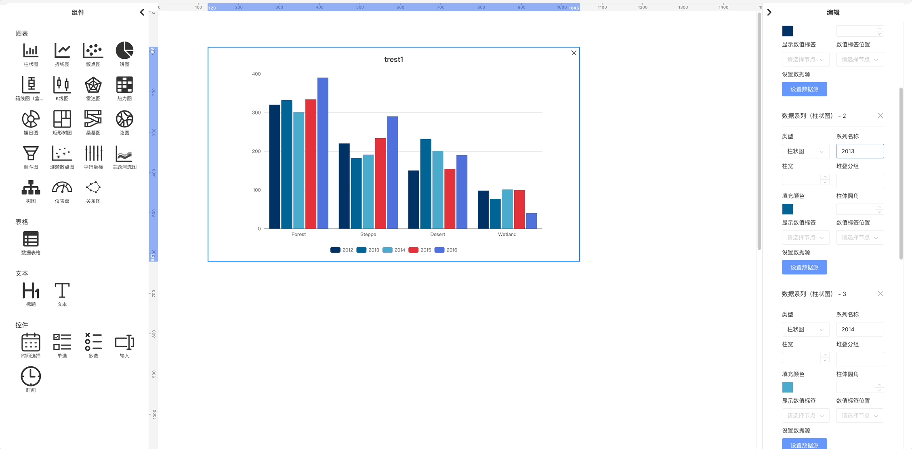

# ngx-puzzle

English | [中文文档](README.zh-CN.md)

[](https://www.npmjs.com/package/@zhongmiao/ngx-puzzle)
[](https://www.npmjs.com/package/@zhongmiao/ngx-puzzle)

[](LICENSE)
[](https://github.com/prettier/prettier)

👉 Example repository (Demo): https://github.com/zhongmiao-org/ngx-puzzle-example

🚀 **Live Demo**: https://www.zhongmiaoorg.cn/



Drag-and-drop dashboard builder for Angular applications. Think of it like a puzzle: compose charts, tables, text, and controls on a canvas to quickly assemble responsive data dashboards. Built with Angular standalone components and signals.

Suitable for rapid prototyping, internal BI dashboards, and data visualization portals.

## Features

- Drag-and-drop editor with snapping layout
- Rich built-in components: chart, standard table, advanced table, text, control
- Architecture-first Angular library (standalone, signals, OnPush)
- External data-binding contract to connect real APIs or mock data
- Preview/save via external service hooks

## Installation

Prefer ng add. Manual install is also supported.

### Option 1: ng add (recommended)

```bash
ng new my-angular21-app --routing=true --style=scss
# or
# npx @angular/cli@21 new my-angular21-app
cd my-angular21-app
ng add @zhongmiao/ngx-puzzle
```

```bash
✔ Determining Package Manager
  › Using package manager: npm
✔ Loading package information from registry
✔ Confirming installation
✔ Installing package
    Added @angular/cdk@^21.2.6 to dependencies
    Added ag-grid-community@^35 and ag-grid-angular@^35 to dependencies
    Added echarts@^6.0.0 to dependencies
    Added lodash@4.17.21 to dependencies
    Added ngx-tethys@^21.0.0 to dependencies
    Added asset mapping: ./node_modules/@zhongmiao/ngx-puzzle/assets -> /assets
    Prepended style import to src/styles.scss: @use "@zhongmiao/ngx-puzzle/styles/index.scss";
    Prepended style import to src/styles.scss: @use 'ngx-tethys/styles/index.scss';
    Added import for provideHttpClient in src/app/app.config.ts
    Added import for providePuzzleLib in src/app/app.config.ts
    Updated assets configuration to include library assets.
    ✅ Configuration updated successfully!
    📦 New dependencies have been added to package.json
    🚀 Please run the following command to install dependencies:
       npm install
UPDATE package.json (1246 bytes)
UPDATE src/styles.scss (171 bytes)
UPDATE src/app/app.config.ts (493 bytes)
UPDATE angular.json (3049 bytes)
```

- If your CLI is older or auto-append fails, use the manual assets configuration below.

### Option 2: Install via package manager

```bash
npm install @zhongmiao/ngx-puzzle
# peer deps
# Angular 21+, RxJS 7.8+, ngx-tethys 21.x, echarts 6.x
```

#### Global styles and static assets

Add global style imports in your app's src/styles.scss:

```scss
@use "@zhongmiao/ngx-puzzle/styles/index.scss";
@use "ngx-tethys/styles/index.scss";
```

As a standalone-first library, ngx-puzzle provides a ready-made provider. Add provideHttpClient() and providePuzzleLib() in src/app/app.config.ts:

```ts
import { providePuzzleLib } from '@zhongmiao/ngx-puzzle';
import { provideHttpClient } from '@angular/common/http';
import { ApplicationConfig, provideZoneChangeDetection } from '@angular/core';
import { provideRouter } from '@angular/router';

import { routes } from './app.routes';

export const appConfig: ApplicationConfig = {
  providers: [provideZoneChangeDetection({ eventCoalescing: true }), provideRouter(routes), provideHttpClient(), providePuzzleLib()]
};
```

Configure static assets in angular.json so library assets are served:

```json
{
  "assets": [
    {
      "glob": "**/*",
      "input": "./node_modules/@zhongmiao/ngx-puzzle/assets",
      "output": "/assets"
    }
  ]
}
```

If you consume @zhongmiao/ngx-puzzle in your own application and need these resources (icons or library assets), add a similar assets entry to your app project's assets list in angular.json.

#### Dependencies added by ng add
If you use `ng add @zhongmiao/ngx-puzzle`, the schematic will add the following dependencies to your package.json (or ensure they exist) with these versions:

```json
{
  "@angular/cdk": "^21.2.6",
  "ag-grid-community": "^35.0.0",
  "ag-grid-angular": "^35.0.0",
  "echarts": "^6.0.0",
  "lodash": "4.17.21",
  "ngx-tethys": "^21.0.0"
}
```

## Compatibility

- Angular: 21+
- Angular cdk: 21+ (used for drag-and-drop)
- ngx-tethys: 21.x (layout)
- ECharts: 6.x (used by chart components)
- ag-grid-community / ag-grid-angular (used by the advanced table component)

See package.json for exact versions.

## Quick Start (standalone)

Use the editor component directly in a standalone host component. For custom data binding, prefer injecting a `PuzzleDataAdapter` through `providePuzzleLib({ dataAdapter })` instead of embedding business-specific SQL or model logic inside library components.

```ts
import { Component } from '@angular/core';
import { ThyContent, ThyLayout } from 'ngx-tethys/layout';
import { NgxPuzzleEditorComponent } from 'ngx-puzzle';

@Component({
  selector: 'example-puzzle',
  standalone: true,
  template: `
    <thy-layout>
      <thy-content>
        <ngx-puzzle-editor></ngx-puzzle-editor>
      </thy-content>
    </thy-layout>
  `,
  imports: [ThyLayout, ThyContent, NgxPuzzleEditorComponent]
})
export class AppPuzzleComponent {}
```

Register a custom data adapter at the app boundary when you need host-specific binding UIs, SQL execution, or model-based querying:

```ts
import { ApplicationConfig } from '@angular/core';
import { provideHttpClient } from '@angular/common/http';
import { providePuzzleLib } from '@zhongmiao/ngx-puzzle';
import { ExamplePuzzleDataAdapter } from './example-puzzle-data-adapter.service';

export const appConfig: ApplicationConfig = {
  providers: [provideHttpClient(), providePuzzleLib({ dataAdapter: ExamplePuzzleDataAdapter })]
};
```

In this setup:

- The library remains a base canvas/editor runtime.
- Standard tables render with `ngx-tethys`.
- Advanced tables render with `ag-grid-community`.
- SQL, query models, and data orchestration stay in the host app's adapter.

## Architecture Overview

- Standalone components only (no NgModules). Use Angular signals for local state and computed() for derived state.
- OnPush change detection for performance.
- External data binding is adapter-driven:
  - `PuzzleDataAdapter.openBinding(...)`: host opens its own binding UI or applies a default binding flow
  - `PuzzleDataAdapter.onControlChange(...)`: host interprets control filters and updates request payloads
  - `PuzzleDataAdapter.executeSource(...)`: host executes data sources, including custom SQL/model adapters if needed
- NgxPuzzleExternalService: retrieve/save editor configs and generate preview id.

## Usage Notes and Best Practices

- Prefer signals over mutable state; use set/update, avoid mutate.
- Keep templates simple; use Angular built-in control flow (@if/@for).
- Use host bindings in the decorator's host field, not HostBinding/HostListener decorators.
- Use NgOptimizedImage for static images.

## Run the example

```bash
npm install
npm start
# open http://localhost:4200 and navigate to the example page
```

## Contributing

See CONTRIBUTING.md (and CONTRIBUTING.zh-CN.md for Chinese).

## Acknowledgements

- ngx-tethys (UI components, dialogs, layout used in examples): https://github.com/atinc/ngx-tethys
- Apache ECharts (chart rendering for built-in chart components): https://echarts.apache.org/ and https://github.com/apache/echarts
- ag-grid-community / ag-grid-angular (advanced table rendering): https://www.ag-grid.com/

## License

MIT. See LICENSE.

## Contributors

- ark65 (liuwufangzhou@gmail.com, liuwufangzhou@qq.vip.com)
