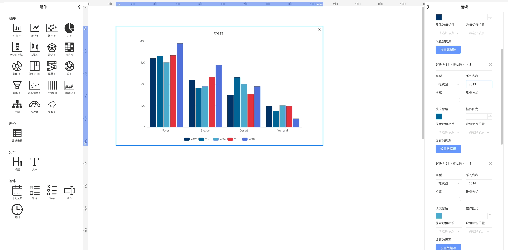

# ngx-puzzle

中文 | [English](README.md)

[](https://www.npmjs.com/package/@zhongmiao/ngx-puzzle)
[](https://www.npmjs.com/package/@zhongmiao/ngx-puzzle)

[](LICENSE)
[](https://github.com/prettier/prettier)

👉 示例仓库（Demo）：https://github.com/zhongmiao-org/ngx-puzzle-example



用于 Angular 的拖拽式看板构建器。像拼图一样在画布上自由组合图表、表格、文本和控件，快速搭建响应式数据大屏。采用 Angular 独立组件（standalone）与 signals 架构。

适合快速原型、企业内部 BI 看板、数据可视化门户。

## 特性

- 拖拽编辑器，吸附布局
- 内置组件：图表、表格、文本、控件
- 以架构为先：standalone、signals、OnPush
- 外置数据绑定协议：可接真实 API 或使用内置 Mock
- 通过外部服务提供预览/保存等能力

## 安装

优先推荐使用 ng add。也可手动安装。

### 方式一：ng add（推荐）

```bash
npx @angular/cli@18 new my-angular18-app
cd my-angular18-app
ng add @zhongmiao/ngx-puzzle
```

- 若 CLI 版本较低或自动追加失败，请参考下述“手动配置静态资源”。

### 方式二：包管理器安装

```bash
npm install @zhongmiao/ngx-puzzle
# 依赖环境：Angular 18+、RxJS 7.8+、ngx-tethys 18.x、echarts 6.x
```

#### ng add 将添加的依赖版本
使用 `ng add @zhongmiao/ngx-puzzle` 时，原理图会向 package.json 添加（或确保存在）以下依赖及版本：

```json
{
  "@angular/cdk": "^18.2.14",
  "@tethys/icons": "1.4.50",
  "@webdatarocks/webdatarocks": "1.4.19",
  "@zhongmiao/ngx-puzzle": "^18.4.13",
  "echarts": "6.0.0",
  "lodash": "4.17.21",
  "ngx-tethys": "^18.2.17"
}
```

## 兼容性

- Angular：18+
- RxJS：7.8+
- ngx-tethys：18.x（示例中用于对话框与布局）
- ECharts：6.x（被图表组件使用）

具体版本参见 package.json。

## 快速开始（standalone）

在独立组件中直接使用编辑器组件。以下示例取自示例应用并做了精简：

```ts
import { Component, inject, OnInit, OnDestroy } from '@angular/core';
import { ThyContent, ThyLayout } from 'ngx-tethys/layout';
import { NgxPuzzleEditorComponent } from 'ngx-puzzle';
import {
  NgxPuzzleControlChangeNotification,
  NgxPuzzleDataBindingRequest,
  NgxPuzzleDataBindingService,
  NgxPuzzleExternalService
} from 'ngx-puzzle/core';
import { Subject, takeUntil } from 'rxjs';
import { ThyDialog } from 'ngx-tethys/dialog';
import { ExampleDataSourceDialogComponent } from './data-source-dialog.component';

@Component({
  selector: 'example-puzzle',
  standalone: true,
  template: `
    <thy-layout>
      <thy-content>
        <ngx-puzzle-editor></ngx-puzzle-editor>
      </thy-content>
    </thy-layout>
  `,
  imports: [ThyLayout, ThyContent, NgxPuzzleEditorComponent]
})
export class AppPuzzleComponent implements OnInit, OnDestroy {
  private puzzleService = inject(NgxPuzzleExternalService);
  private dataBindingService = inject(NgxPuzzleDataBindingService);
  private destroy$ = new Subject<void>();
  private dialog = inject(ThyDialog);

  ngOnInit() {
    this.dataBindingService.bindingRequest$.pipe(takeUntil(this.destroy$)).subscribe((request) => this.handleDataBindingRequest(request));

    this.dataBindingService.controlChange$
      .pipe(takeUntil(this.destroy$))
      .subscribe((notification) => this.handleControlChange(notification));
  }

  ngOnDestroy() {
    this.destroy$.next();
    this.destroy$.complete();
  }

  private handleDataBindingRequest(request: NgxPuzzleDataBindingRequest) {
    const initialData: any = {};
    if (request.apiSource) {
      initialData.type = request.apiSource.method as 'GET' | 'POST';
      initialData.url = request.apiSource.url;
      if (request.apiSource.method === 'POST' && request.apiSource.params) {
        try {
          initialData.body = JSON.stringify(request.apiSource.params, null, 2);
        } catch {
          initialData.body = '';
        }
      }
    }

    const ref = this.dialog.open(ExampleDataSourceDialogComponent, {
      initialState: {
        inputType: initialData.type,
        inputUrl: initialData.url,
        inputBody: initialData.body
      }
    });

    ref
      .afterClosed()
      .pipe(takeUntil(this.destroy$))
      .subscribe((result: any) => {
        if (!result) return;
        const apiSource = this.createApiSourceFromDialog(result);
        const existed = this.dataBindingService.getComponentDataRequest(request.componentId) || { apiSources: [] };
        const streams = existed.apiSources ? [...existed.apiSources] : [];
        if (apiSource) streams[request.seriesIndex] = apiSource;

        this.dataBindingService.responseBinding({
          componentId: request.componentId,
          dataRequest: { ...existed, apiSources: streams }
        });
      });
  }

  private handleControlChange(notification: NgxPuzzleControlChangeNotification) {
    const newSources = [
      { url: '/api/chart-data-1', method: 'POST', params: this.buildParamsFromFilters(notification.controlFilters) },
      { url: '/api/chart-data-2', method: 'POST', params: this.buildParamsFromFilters(notification.controlFilters) }
    ];

    this.dataBindingService.responseBinding({
      componentId: notification.componentId,
      dataRequest: { apiSources: newSources }
    });
  }

  private createApiSourceFromDialog(result: {
    type: 'GET' | 'POST';
    url: string;
    body?: string;
  }): { url: string; method: string; params?: Record<string, unknown> } | undefined {
    if (result?.url && result.url.trim()) {
      const url = result.url.trim();
      if (result.type === 'POST') {
        let payload: unknown;
        try {
          payload = result.body ? JSON.parse(result.body) : {};
        } catch {
          payload = {};
        }
        return { url, method: 'POST', params: payload as Record<string, unknown> };
      }
      return { url, method: 'GET' };
    }
    return undefined; // 走组件内部的 Mock
  }

  private buildParamsFromFilters(filters: unknown) {
    return { filters };
  }
  save() {
    this.puzzleService.getAllConfigs();
  }
  preview() {
    this.puzzleService.generatePreviewId();
  }
}
```

### 上例中的数据源配置对话框

```ts
import { Component, inject, input, OnInit, signal } from '@angular/core';
import { ThyDialog, ThyDialogBody, ThyDialogFooter, ThyDialogHeader } from 'ngx-tethys/dialog';
import { ThySelect } from 'ngx-tethys/select';
import { ThyOption } from 'ngx-tethys/shared';
import { FormsModule } from '@angular/forms';
import { ThyInputDirective } from 'ngx-tethys/input';
import { ThyButton } from 'ngx-tethys/button';
import { NgIf } from '@angular/common';

@Component({
  selector: 'example-data-source-dialog',
  standalone: true,
  imports: [ThyDialogHeader, ThyDialogBody, ThyDialogFooter, ThySelect, ThyOption, FormsModule, ThyInputDirective, ThyButton, NgIf],
  template: `...` // 详见示例项目中的完整模板
})
export class ExampleDataSourceDialogComponent implements OnInit {
  private dialog = inject(ThyDialog);
  inputType = input<'GET' | 'POST'>('GET');
  inputUrl = input<string>('');
  inputBody = input<string>('');
  type = signal<'GET' | 'POST'>('GET');
  url = signal<string>('');
  body = signal<string>('');
  ngOnInit() {
    this.type.set(this.inputType() ?? 'GET');
    this.url.set(this.inputUrl() ?? '');
    this.body.set(this.inputBody() ?? '');
  }
  confirm() {
    this.dialog.close({ type: this.type(), url: this.url(), body: this.body() });
  }
  close() {
    this.dialog.close();
  }
}
```

## 架构与数据绑定

- 仅使用独立组件（standalone）；局部状态用 signals，派生状态用 computed。
- OnPush 变更检测。
- 通过 NgxPuzzleDataBindingService 实现外部数据绑定：
  - bindingRequest$：组件发起数据请求（包含 componentId、seriesIndex、apiSource 等）
  - responseBinding(...)：外部响应并传入 dataRequest，其中 apiSources 为数组
  - controlChange$：控件类组件变化时通知外部，外部可据此更新 apiSources
- NgxPuzzleExternalService：用于获取/保存编辑器配置、生成预览 ID。

## 使用建议

- 优先使用 signals（set/update），避免 mutate。
- 模板保持简洁，使用内置控制流（@if/@for）。
- 不使用 @HostBinding/@HostListener；改用装饰器的 host 配置。
- 静态图片使用 NgOptimizedImage。

## 运行示例

```bash
npm install
npm start
# 打开 http://localhost:4200 查看示例
```

## 全局样式与静态资源

在应用的 src/styles.scss 中加入以下全局样式：

```scss
@import "@zhongmiao/ngx-puzzle/styles/index.scss";
@import "ngx-tethys/styles/index.scss";
```

在 angular.json 中配置静态资源，确保图标与库资源可被访问：

```json
{
  "assets": [
    {
      "glob": "**/*",
      "input": "./node_modules/@zhongmiao/ngx-puzzle/assets",
      "output": "/assets"
    }
  ]
}
```

各项含义：
- example/src/favicon.ico：示例应用的站点图标。
- example/src/assets：示例页面用到的自有静态资源目录。
- node_modules/@tethys/icons -> /assets/icons：暴露 Tethys 图标资源，供 UI 组件按需加载。
- projects/puzzle/src/assets -> /assets：暴露库内置资源（如编辑器背景等）给示例应用使用。

如果你在自己的应用中使用 @zhongmiao/ngx-puzzle，并且需要这些资源（图标或库资源），可在应用的 angular.json 中为对应项目添加类似的 assets 配置。

## 贡献

请阅读 CONTRIBUTING.md（中文参见 CONTRIBUTING.zh-CN.md）。

## 致谢

- ngx-tethys（示例中的 UI 组件、对话框与布局）：https://github.com/atinc/ngx-tethys
- Apache ECharts（内置图表组件的渲染引擎）：https://echarts.apache.org/ 及 https://github.com/apache/echarts

## 许可证

MIT，详见 LICENSE。

## 贡献者

- ark65 (liuwufangzhou@gmail.com, liuwufangzhou@qq.vip.com)
